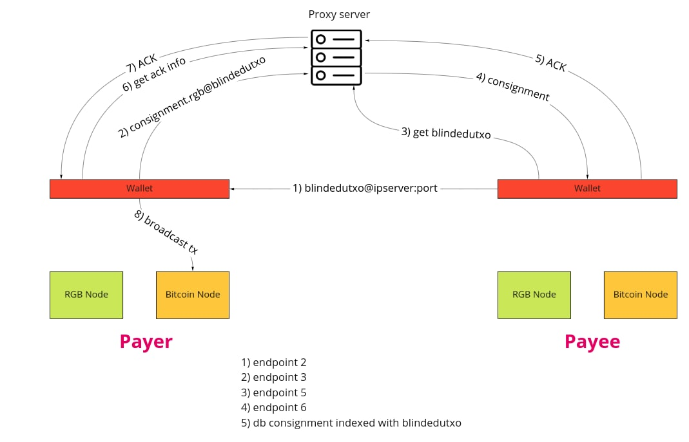

# RGB proxy server



## Running the app

```
# install dependencies
npm install

# run in dev mode on port 3000
npm run dev

# generate production build
npm run build

# run generated content in dist folder on port 3000
npm run start
```

## Testing

### Jest with supertest

```
npm run test
```

## Linting

```
# run linter
npm run lint

# fix lint issues
npm run lint:fix
```
